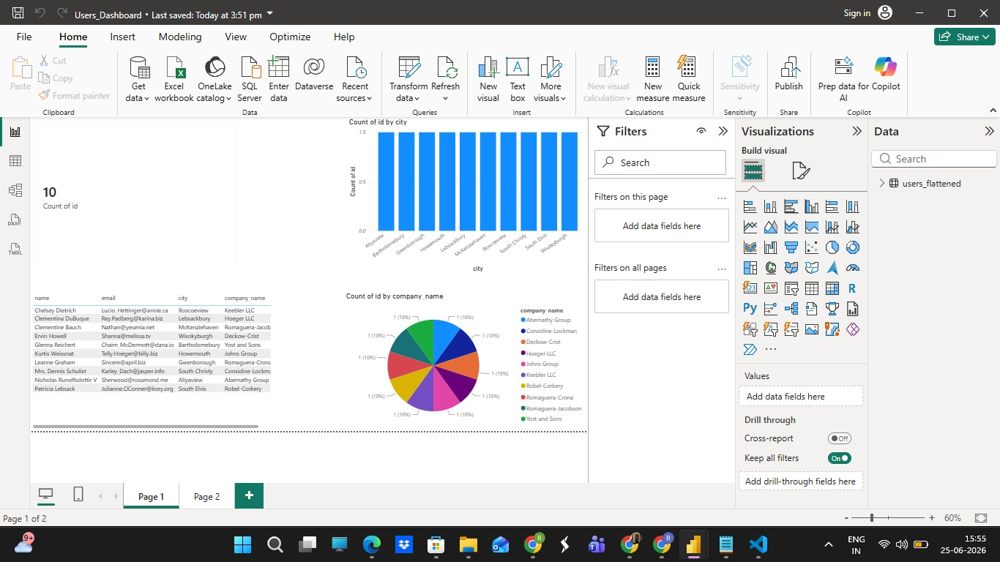

🚀 Azure Data Engineering Pipeline with Power BI

📖 Overview

This project demonstrates an end-to-end Azure Data Engineering Pipeline built using Microsoft Azure services. The pipeline ingests raw JSON data, transforms it into a structured format, stores the processed data in Azure Data Lake Storage Gen2, and visualizes key insights through an interactive Power BI dashboard.

---

🏗️ Architecture Diagram

«Place your architecture image in the "architecture" folder.»

---

🔄 Project Workflow

JSON Data
     │
     ▼
Azure Data Lake Storage Gen2 (Raw)
     │
     ▼
Azure Data Factory (ADF)
     │
     ▼
Azure Databricks (PySpark)
     │
     ▼
Azure Data Lake Storage Gen2 (users_flattened)
     │
     ▼
Power BI Dashboard

---

🛠️ Technologies Used

- ☁️ Azure Data Factory (ADF)
- 📦 Azure Data Lake Storage Gen2 (ADLS Gen2)
- ⚡ Azure Databricks
- 🐍 PySpark
- 📊 Power BI
- 💻 Visual Studio Code
- 🌿 Git & GitHub

---

📂 Project Structure

azure-data-project/
│
├── README.md
├── .gitignore
├── .env
│
├── architecture/
│   └── architecture.jpeg
│
├── adf/
│   ├── pipeline.json
│   ├── linked_service_adls.json
│   ├── linked_service_databricks.json
│   ├── linked_service_rest.json
│   ├── source_dataset.json
│   └── sink_dataset.json
│
├── data/
│   ├── users.json
│   └── users_flattened.parquet
│
├── databricks/
│   ├── ingest.py
│   ├── users_transformation.py
│   └── presentation.py
│
├── docs/
│   └── workflow.md
│
├── powerbi/
│   └── Users_Dashboard.pbix
│
└── screenshots/
    ├── adf_pipeline.jpeg
    ├── pipeline_success.jpeg
    ├── datasets.png
    ├── databricks_notebook.jpeg
    ├── databricks_workspace.png
    ├── storage_account.png
    ├── storage_account_ingestedcontainer.jpeg
    ├── storage_ac_raw_container.png
    ├── storage_ac_transform_container.png
    ├── storage_ac_presentation_container.jpeg
    └── powerbi_dashboard.jpeg

---

✨ Key Features

- ✅ Built an end-to-end Azure Data Engineering pipeline.
- ✅ Automated data ingestion using Azure Data Factory.
- ✅ Stored raw and transformed data in Azure Data Lake Storage Gen2.
- ✅ Transformed nested JSON data using Azure Databricks and PySpark.
- ✅ Created an interactive Power BI dashboard.
- ✅ Managed the project using Git and GitHub.

---

📊 Power BI Dashboard

«Add your Power BI dashboard screenshot to the "screenshots" folder.»

---

📸 Project Screenshots

- Azure Data Factory Pipeline
- Successful Pipeline Execution
- Azure Data Lake Storage Containers
- Databricks Notebook
- Power BI Dashboard

---

🎯 Skills Demonstrated

- Azure Data Factory (ADF)
- Azure Data Lake Storage Gen2
- Azure Databricks
- PySpark
- ETL Pipeline Development
- Data Transformation
- Power BI
- Git & GitHub

---

👩‍💻 Author

Devananda B B

